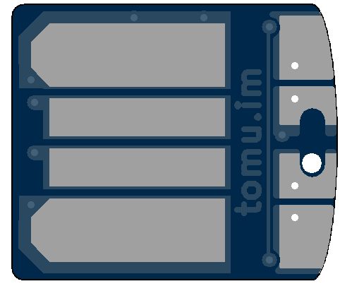
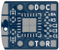

# Tomu Hardware

[I'm Tomu](tomu.im) a tiny ARM microprocessor which fits in your USB port.
I have two buttons and two LEDs.

## Contact

We're available on mailing lists and IRC:

* [IRC Channel - irc://irc.freenode.net/#tomu](https://webchat.freenode.net/?channels=#tomu) - IRC channel for discussing anything related to the project.
* [Announcement mailing list](https://groups.google.com/forum/#!forum/tomu-announce/join) - Low traffic list for announcements.
* [Discussion mailing list](https://groups.google.com/forum/#!forum/tomu-discuss/join) - List for discussing development / new features / etc.

## About the PCB

Built out of a 3D printed part + 2 layer "thin" PCB.  LCA2018 and Crowd Supply
boards are 0.6mm.

Designs and documentation are available in:

* [`pcb/`](./pcb): [KiCad](http://kicad.org/) design files
* [`docs/`](./docs): PDF schematics, pin-out diagrams, and 3D renders

The board requirements are very lo-fi:

* 6mil traces
* 6mil clearance
* 0.3mm drill / 0.6mm vias

The primary MCU is a Silicon Labs EFM32HG309 ([datasheet](https://www.silabs.com/Support%20Documents/TechnicalDocs/EFM32HG309.pdf), [reference manual](https://www.silabs.com/Support%20Documents/TechnicalDocs/EFM32HG-RM.pdf)).

The important features are:

* [Available on Digikey](http://www.digikey.com/product-detail/en/silicon-labs/EFM32HG309F64G-A-QFN24/336-3207-ND/5142721)
* QFN24 - 5mm x 5mm package
* Inbuilt 5V to 3V3 regulator.
* Crystal-less USB

These make something which is almost hand solder-able fit into the tiny size.

## BOM

All parts are available from Digikey, and are readily available from other suppliers.

* [Kitspace Page](https://kitspace.org/boards/github.com/im-tomu/tomu-hardware/) has links to buy from multiple retailers and download the Gerbers
* [Digikey BOM in CSV format](bom-digikey.csv)
* [Digikey Shared Cart](http://www.digikey.com.au/short/39z1zv)

### Individual Parts

* Resistors
  * 2 x 0402 - 15 Ohm - [Digikey](https://www.digikey.com.au/short/3m8rz5)
  * 2 x 0402 - ~50 Ohm (Depends on LED choice)
* Capacitors - [Digikey Capacitors 0402, >1uF](https://www.digikey.com.au/short/3m8r4z)
  * 2 x Capacitor 1uF 0402
  * 1 x Capacitor 4.7uF 0402
* 2 x LED 0402
  * You choice of two different colors (might require adjustment of R1/R2).
  * 5mA LEDs are better choice.
  * Get highest millicandela rating you can.
  * [Digikey Search of LEDs in 0402 package](https://www.digikey.com.au/short/3m8rz0)
* 1 x EFM32HG309 or EMF32HG308

## Case

The PCB is thinner than a USB socket, and has exposed contacts on the reverse side, so it _needs a case_ in order to make proper contact with the USB pins, and to not short on the shield of the USB port.

Early prototypes used a business card that had been folded over, however the crowd funding campaign made enough to cut steel and make a case.

Designs are available in the [`case/`](./case) directory.  Cases for earlier board versions tend to require higher tolerance on 3D printers.

## FAQ

### Why did you create this?

The aim was to prove that a device which fits in your USB port could be created
**by hobbyists in small quantities** extremely cheaply.

### Where does the name Tomu come from?

TOMU comes from the abbreviation "Tim's Open Micro USB".

### What can I use this for?

What ever you want! If you do create something, please send me the info!

## License

The contents of this repository excluding [`third_party`
directory](./third_party) is released under your choice of the following two
licences:

* the "Creative Commons Attribution-ShareAlike 4.0 International License"
  (CC BY-SA 4.0) full text of this license is included in the
  [LICENSE.CC-BY-SA-4.0](LICENSE.CC-BY-SA-4.0) file and a copy can also be
  found at http://creativecommons.org/licenses/by-sa/4.0/
* the "TAPR Open Hardware License" full text of this license is included
  in the [LICENSE.TAPR](LICENSE.TAPR) file and a copy can also be found at
  http://www.tapr.org/OHL
